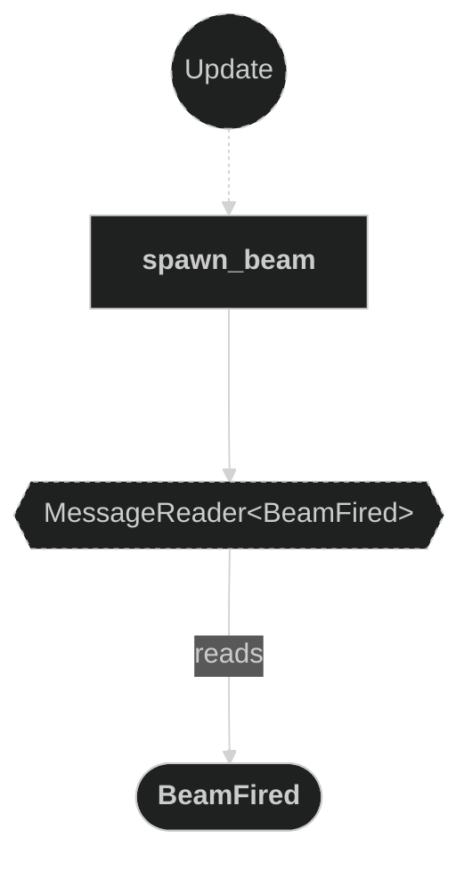
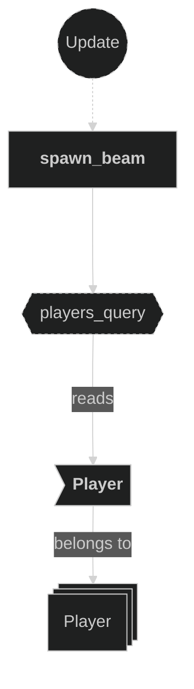
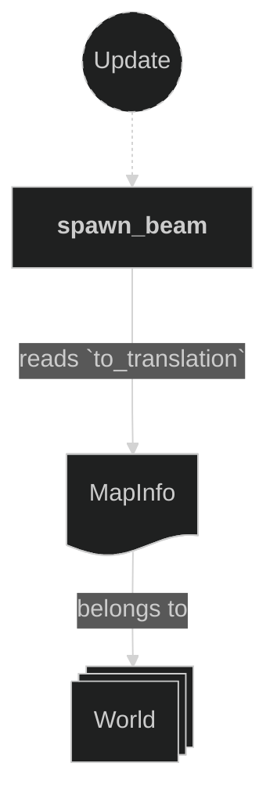
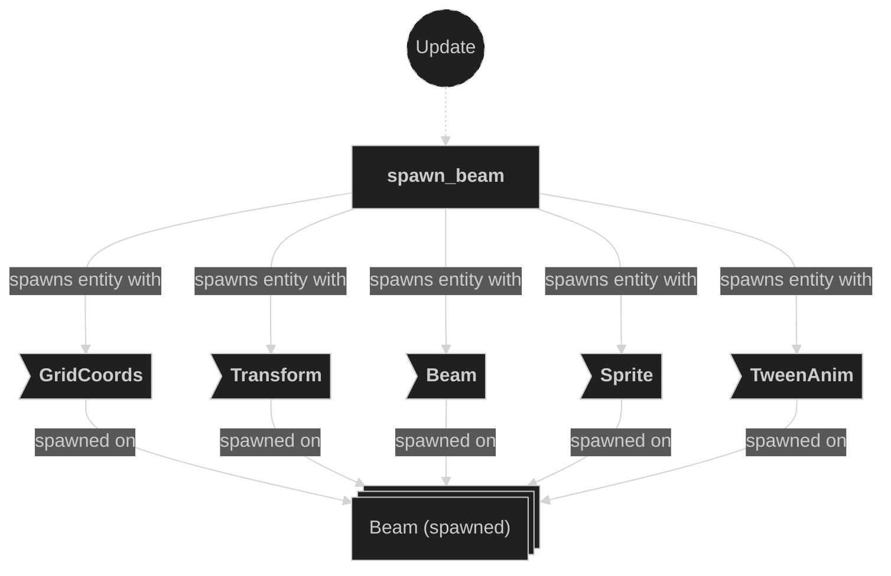
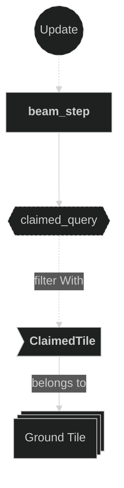
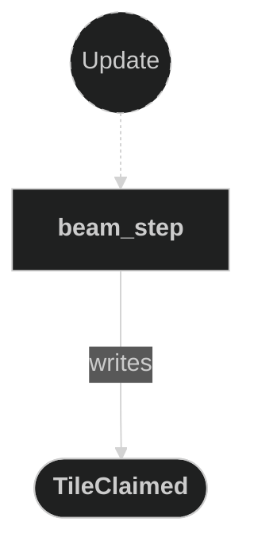

# Beam Plugin

Contains systems responsible for spawning and stepping beam projectiles fired by players. When a player shoots, a `Beam` entity is created at the player's current grid position and advances one tile per frame in the firing direction until it either leaves the map bounds or hits an already-claimed tile, at which point the current tile is claimed and the beam is despawned.

## Plugin workflow

- Update phase
    - Spawn Beam:
        - Reacts to `BeamFired` message
            - Reads:
                - `BeamFired` message fields (`owner`, `origin`, `direction`)
                - `Player` component of the firing player (for sprite atlas index)
                - `MapInfo` resource (for world-space translation of origin)
                - `AssetServer` and `Assets<TextureAtlasLayout>` (for sprite setup)
            - Writes:
                - Spawns a new `Beam` entity with `GridCoords`, `Transform`, `Beam`, `Sprite` and `TweenAnim`
    - Beam Step:
        - Runs every frame on all existing `Beam` entities
            - Reads:
                - `Beam` component (`owner`, `direction`)
                - `MapInfo` resource (for bounds check and tile entity lookup)
                - `ClaimedTile` component on ground tile entities (for claimed-tile check)
            - Writes:
                - Advances `GridCoords` of the beam if the next tile is valid and unclaimed
                - Writes a `TileClaimed` message and despawns the beam when it must stop

## Plugin Systems

### Spawn Beam

Reacts to `BeamFired` messages emitted by the input system. For each message, it looks up the firing `Player` to determine the correct sprite atlas index, converts the origin `GridCoords` to a world-space `Transform` via `MapInfo`, and spawns a `Beam` entity carrying `GridCoords`, `Transform`, `Beam` (owner + direction + speed), `Sprite` (atlas tile from `grid_tiles2-Sheet.png`), and a `TweenAnim` initialised at rest (same start and end position) with `destroy_on_completed` disabled.

### Beam Step

Runs every frame. For each `Beam` entity it computes the next grid position (`current + direction`) and applies two stopping rules in order:

1. **Out of bounds** — if the next position is not on ground, emit `TileClaimed` for the *current* position and despawn.
2. **Already claimed** — if the next tile's ground entity already carries a `ClaimedTile` component, emit `TileClaimed` for the *current* position and despawn.

If neither rule fires, the beam advances: `GridCoords` is overwritten with the next position (which triggers `translate_objects` in the Movements plugin to tween the sprite).

## Components, Resources and Messages CRUD

### Read BeamFired messages

Used in the following systems:
- **spawn_beam**: used to trigger beam entity creation

### Query Player (spawn)

Used in the following systems:
- **spawn_beam**: reads the `Player` component of the firing entity to select the correct sprite atlas index

### Read MapInfo resource (spawn)

Used in the following systems:
- **spawn_beam**: converts the beam origin `GridCoords` to a world-space `Vec3` via `to_translation()`

### Write commands — spawn Beam entity

Used in the following systems:
- **spawn_beam**: spawns a new `Beam` entity with all required components

### Query Beam entities

Used in the following systems:
- **beam_step**: reads `Beam` (owner + direction) and writes `GridCoords` on all active beam entities each frame

### Query ClaimedTile (beam step)

Used in the following systems:
- **beam_step**: checks whether the next ground tile entity already carries a `ClaimedTile` component to decide if the beam must stop

### Read MapInfo resource (beam step)

Used in the following systems:
- **beam_step**: used to check `on_ground()` for the next position and to resolve the ground tile entity via `ground_entities` HashMap

### Write TileClaimed messages

Used in the following systems:
- **beam_step**: emits a `TileClaimed` message with the beam's current position and owner when the beam stops (out of bounds or claimed tile hit)

### Write commands — despawn Beam entity

Used in the following systems:
- **beam_step**: despawns the beam entity after emitting `TileClaimed` when a stopping condition is met

