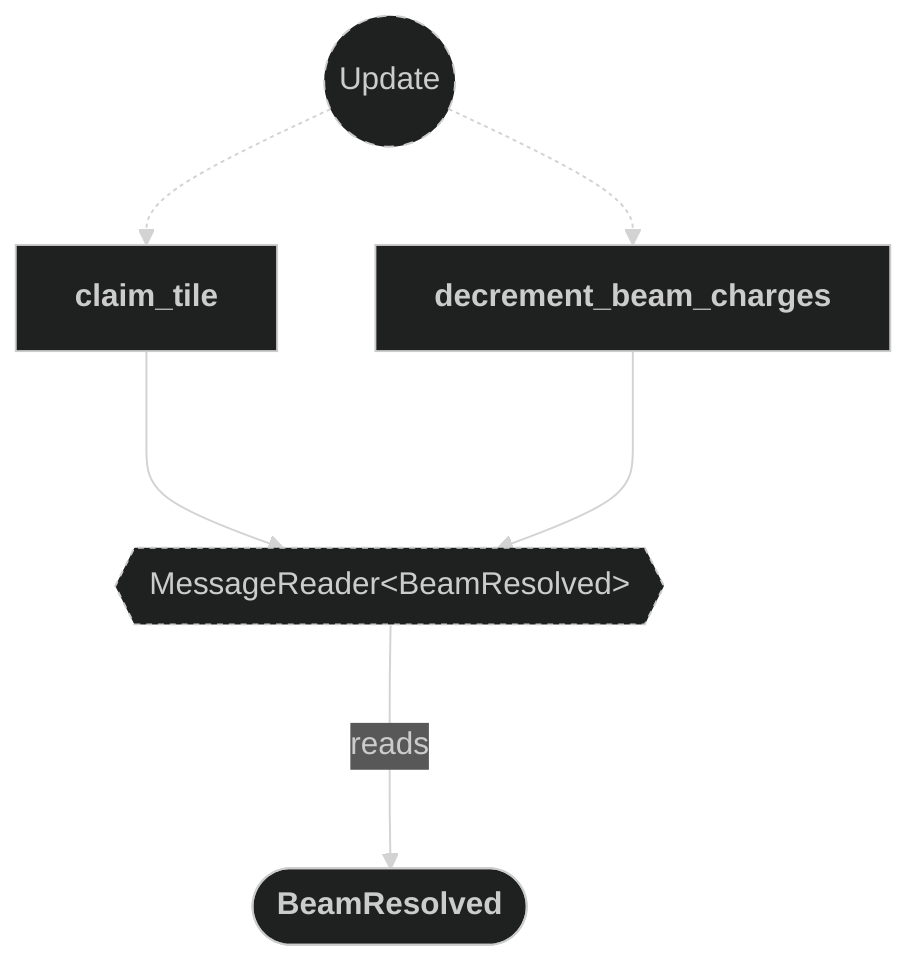
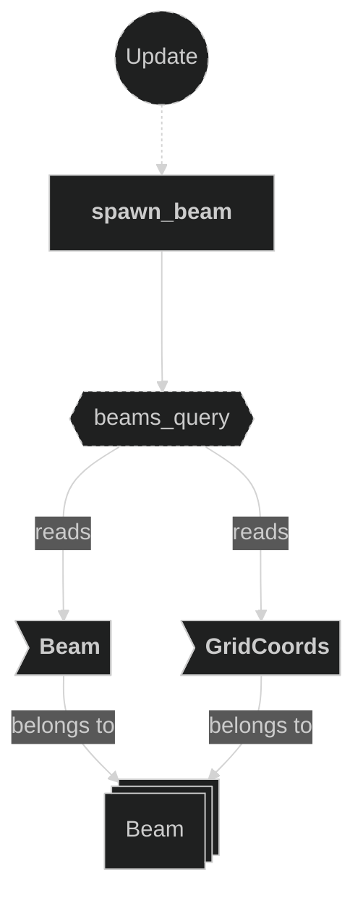
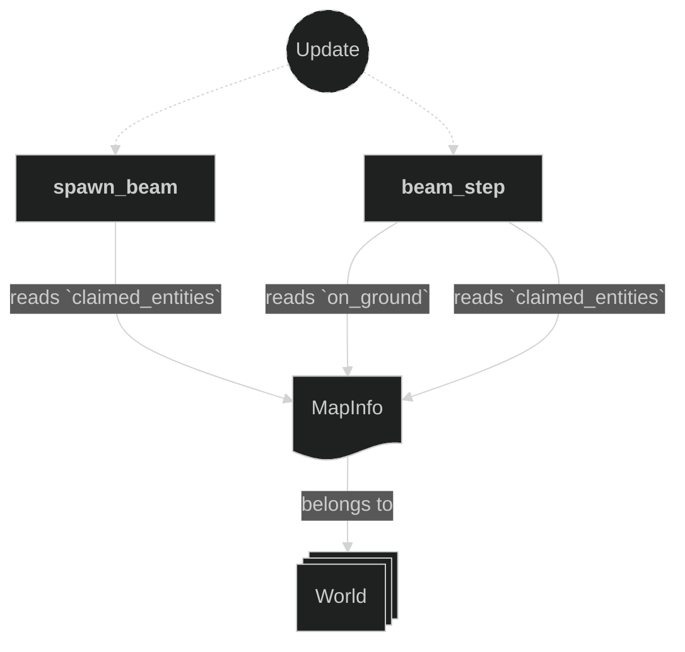
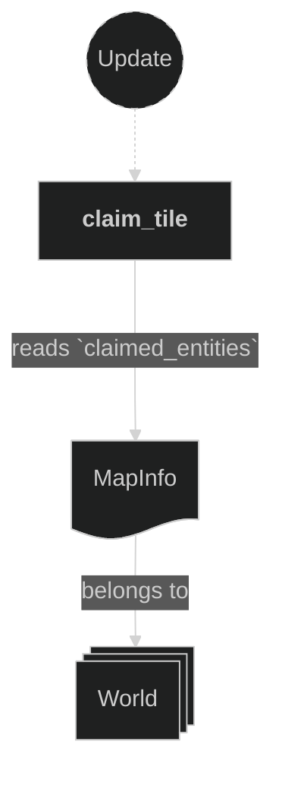
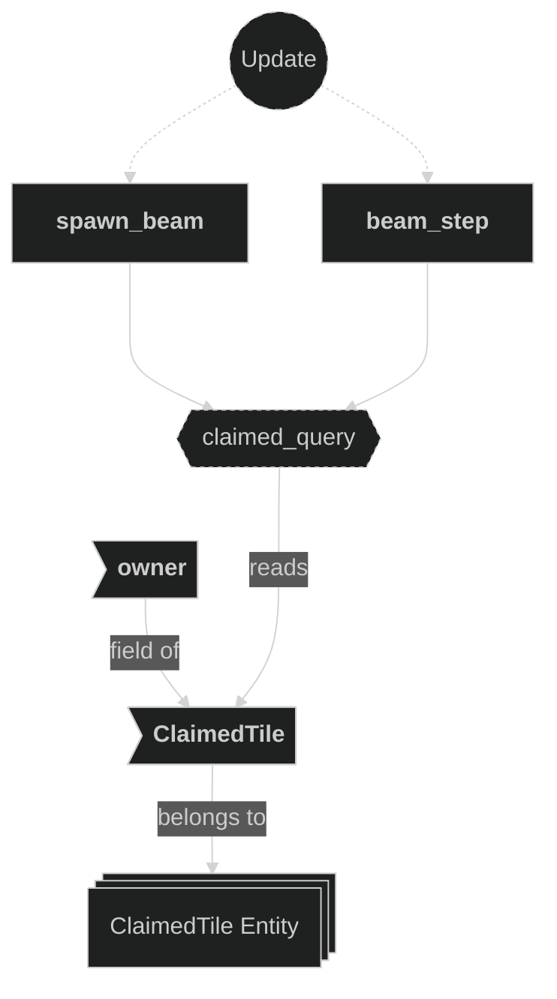
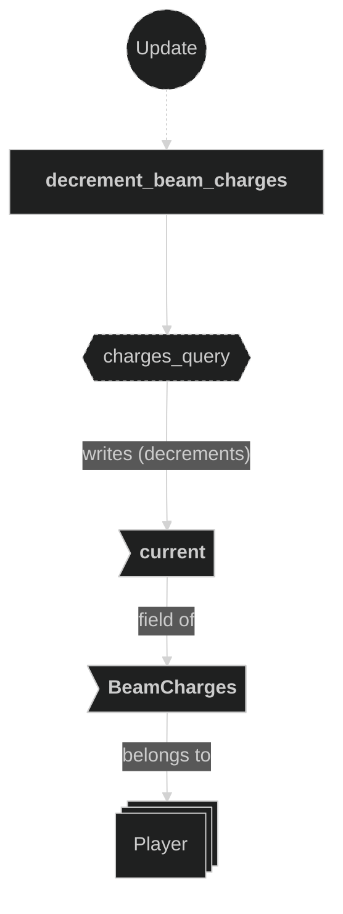

# Beam Plugin

Contains systems responsible for spawning and stepping beam projectiles fired by players, for claiming tiles when a beam stops, and for decrementing the firing player's beam charges. When a player shoots, a `Beam` entity is created at the player's current grid position and advances one tile per beam-step timer tick in the firing direction. The beam's behaviour depends on whether its origin tile was claimed at fire time:

- **Normal mode** (origin unclaimed): advances until it leaves the map bounds or the next tile is already claimed. Resolves at the last unclaimed position.
- **Inverted mode** (origin claimed): advances through claimed and forbidden tiles until the next tile would be unclaimed. Resolves at the current position (just before the first unclaimed tile). If no unclaimed tile is encountered before the edge, the beam despawns silently without claiming anything.

When the beam resolves, `BeamResolved` is emitted, `claim_tile` updates tile ownership, `decrement_beam_charges` decrements the player's `BeamCharges::current`, and the beam entity is despawned.

## Plugin workflow

- Startup phase
    - `setup_beam_step_timer` inserts the `BeamStepTimer` resource (62.5 ms repeating).
- Update phase
    - Spawn Beam:
        - Reacts to `BeamFired` message
            - Reads:
                - `BeamFired` message fields (`owner`, `origin`, `direction`)
                - `Beam` and `GridCoords` components on active beams (to detect lane overlap)
                - `MapInfo` resource and `ClaimedTile` components (to determine if origin tile is claimed)
            - Writes:
                - Always spawns a `Beam` entity with `GridCoords` and `Beam{owner,direction,speed,inverted}`
                - `inverted` is `true` when the origin tile's `ClaimedTile::owner` is `Some` at fire time
                - Also inserts `BounceEffect` unless the owner already has an active beam on the same row (horizontal fire) or same column (vertical fire)
    - Beam Step:
        - Runs on every `BeamStepTimer` tick (62.5 ms)
            - Reads:
                - `Beam` component (`owner`, `direction`)
                - `MapInfo` resource (for bounds check and tile entity lookup)
                - `ClaimedTile` component on ground tile entities (for claimed-tile check)
            - Writes:
                - Advances `GridCoords` of the beam if the next tile is valid and unclaimed
                - Writes a `BeamResolved` message and despawns the beam when it must stop
    - Claim Tile:
        - Reacts to `BeamResolved` message
            - Reads:
                - `BeamResolved` message fields (`position`, `owner`)
                - `MapInfo` resource (to resolve `GridCoords` → claimed tile `Entity` via `claimed_entities`)
            - Writes:
                - Mutates `ClaimedTile::owner` on the matched entity in `MapInfo::claimed_entities`
    - Decrement Beam Charges:
        - Reacts to `BeamResolved` message
            - Reads:
                - `BeamResolved` message fields (`owner`)
                - `BeamCharges` component on the firing player entity
            - Writes:
                - Decrements `BeamCharges::current` on the firing player (saturating at zero)

## Plugin Systems

### Setup Beam Step Timer

Runs once at startup. Inserts the `BeamStepTimer` resource — a repeating `Timer` with a 62.5 ms period — that gates how frequently each beam advances by one tile.

### Spawn Beam

Reacts to `BeamFired` messages emitted by the input system. For each message, checks whether the origin tile's `ClaimedTile::owner` is `Some` (using `MapInfo::claimed_entities` and a `ClaimedTile` query) to determine if the beam should be inverted. Always spawns a new `Beam` entity carrying `GridCoords` (set to `origin`) and `Beam{owner, direction, speed, inverted}`. Additionally inserts `BounceEffect` on the spawned entity only when the owner has no existing beam traveling on the same lane — a horizontal beam suppresses `BounceEffect` if another of the owner's beams shares the same row (Y coordinate) and is also horizontal; a vertical beam suppresses it if another shares the same column (X coordinate) and is also vertical. This prevents overlapping visual effects when beams travel the same path. No sprite or transform is set up here — visual representation is handled by the effects and animations plugins reacting to the `BounceEffect` component.

### Beam Step

Runs every `BeamStepTimer` tick. For each `Beam` entity it computes the next grid position (`current + direction`) and applies mode-dependent stopping rules:

**Inverted mode** (`Beam::inverted == true`, fired from a claimed tile):
1. **Out of bounds** — if the next position is neither on ground nor in forbidden areas, despawn silently (no `BeamResolved` emitted, no tile claimed).
2. **Next tile is unclaimed ground** — emit `BeamResolved` for `next_position` (the unclaimed tile itself), and despawn.
3. Otherwise (claimed or forbidden tile ahead) — advance.

**Normal mode** (`Beam::inverted == false`, fired from an unclaimed tile):
1. **Out of bounds** — if the next position is not on ground, back up through any forbidden areas; if the current position is unclaimed emit `BeamResolved` for it, then despawn.
2. **Already claimed** — if the `ClaimedTile` entity at the next position already has an owner, back up through forbidden areas; if the current position is unclaimed emit `BeamResolved` for it, then despawn.
3. Otherwise — advance: `GridCoords` is overwritten with the next position (which triggers `apply_translate_effect` in the Effects plugin to tween the sprite).

### Claim Tile

Reads `BeamResolved` messages. For each message, looks up the corresponding claimed tile entity from `MapInfo::claimed_entities` using the message's `GridCoords` position, then mutates `ClaimedTile::owner` on that entity to record the new owning player. This is the authoritative write that marks a tile as belonging to a player, and is subsequently read by the Animations plugin to switch the tile's visual appearance.

### Decrement Beam Charges

Reads `BeamResolved` messages. For each message, decrements `BeamCharges::current` (saturating at zero) on the firing player entity identified by `message.owner`. The resulting `Changed<BeamCharges>` detection drives the digit flip-counter animation in the Animations plugin.

## Components, Resources and Messages CRUD

### Read BeamFired messages

Used in the following systems:
- **spawn_beam**: used to trigger beam entity creation

### Read BeamResolved messages

Used in the following systems:
- **claim_tile**: used to trigger tile ownership mutation when a beam stops
- **decrement_beam_charges**: used to trigger beam charge decrement when a beam stops

### Query Beam entities (spawn)

Used in the following systems:
- **spawn_beam**: reads `Beam.owner`, `Beam.direction`, and `GridCoords` of all active beams to detect lane overlap before deciding whether to insert `BounceEffect`

### Read MapInfo resource (spawn beam / beam step)

Used in the following systems:
- **spawn_beam**: reads `claimed_entities` to check if the origin tile is claimed (sets `Beam::inverted`)
- **beam_step**: checks `on_ground()` and `on_forbidden_areas()` for the next position and resolves tile entities via `claimed_entities`

### Read MapInfo resource (claim tile)

Used in the following systems:
- **claim_tile**: used to look up the claimed tile entity via `MapInfo::claimed_entities` for the resolved `GridCoords`

### Write commands — spawn Beam entity

Used in the following systems:
- **spawn_beam**: spawns a new `Beam` entity with grid position, beam data, and bounce effect

### Query Beam entities

Used in the following systems:
- **beam_step**: reads `Beam` (owner + direction) and writes `GridCoords` on all active beam entities each timer tick

### Query ClaimedTile (spawn beam / beam step)

Used in the following systems:
- **spawn_beam**: reads `ClaimedTile::owner` on the origin tile entity to determine if the beam should be inverted
- **beam_step**: checks whether the next ground tile's `ClaimedTile` already has an owner to decide if the beam must stop (normal mode) or is unclaimed and should trigger resolution (inverted mode)

### Write BeamResolved messages

Used in the following systems:
- **beam_step**: emits a `BeamResolved` message with the beam's current position and owner when the beam stops (out of bounds or claimed tile hit)

### Write ClaimedTile (claim tile)

Used in the following systems:
- **claim_tile**: mutates `ClaimedTile::owner` on the matched claimed tile entity to record the new owning player

### Write commands — despawn Beam entity

Used in the following systems:
- **beam_step**: despawns the beam entity after emitting `BeamResolved` when a stopping condition is met

### Query BeamCharges (decrement_beam_charges)

Used in the following systems:
- **decrement_beam_charges**: reads and mutably decrements the `BeamCharges` component on the firing player entity after a beam resolves

