# Beam Plugin

Contains systems responsible for spawning and stepping beam projectiles fired by players, and for spending the firing player's beam charges. Tile ownership is handled separately by the Claim plugin, which reacts to the `BeamResolved` messages this plugin emits. When a player shoots, a `Beam` entity is created at the player's current grid position and advances one tile per beam-step timer tick in the firing direction. Each beam carries a resolved execution mode, `Beam::behavior` (`BeamBehavior`). `spawn_beam` resolves the shot with `resolve_fire`, which yields one of three outcomes based on firing context and the player's drafted abilities:

- **No beam** — firing from an already-claimed tile is refused: `resolve_fire` returns nothing and `spawn_beam` skips the spawn entirely, spending no charge. The Input plugin applies the same check before writing `BeamFired`, so a refused shot normally never reaches `spawn_beam` at all; `spawn_beam` still re-checks `resolve_fire` itself, since the origin's claim state can change between the input tick and the message being read, and that `None` branch spends nothing. The `Lance` ability is the sole exception (below).
- **Straight** (the baseline): the mode for any shot fired from unclaimed ground. It advances until it leaves the map bounds or the next tile is already claimed, resolving at the last unclaimed position (at minimum its own origin).
- **Lance** (a drafted ability): advances through claimed and forbidden tiles until the next tile would be unclaimed, resolving on that unclaimed tile; despawns silently if none is found before the edge. `spawn_beam` selects it only when the beam is fired from already-claimed ground **and** the firing player's `AbilityList` contains `AbilityDescriptor::Lance` (see the Abilities plugin doc) — it is what lets a player fire from their own territory at all.

Charges are spent **on fire**, not on resolve: once `resolve_fire` yields a behavior, `spawn_beam` decrements the owner's `BeamCharges::current`, increments `InFlightBeamCount::current`, and emits `ChargeSpent`, all before the `Beam` entity is spawned. A shot refused by `resolve_fire` costs nothing; the only shot that spends a charge without claiming anything is a `Lance` that reaches the map edge unclaimed. `InFlightBeamCount` is a per-player component, synchronously maintained (incremented here, decremented in `beam_step` via `end_beam`) so other plugins can read an always-current in-flight count instead of scanning `Query<&Beam>`, which lags a frame behind `Commands::spawn`/`despawn` (see the lifecycle section below). When a beam resolves, `BeamResolved` is emitted and the beam is despawned via `end_beam` (which also releases the in-flight slot); the Claim plugin reads that message to update ownership and emit `TileClaimed`, registered `.after(beam_step)` so a same-frame claim is visible to anything reading `ClaimedTileCount` later that frame.

## Plugin workflow

- Startup phase
    - `setup_beam_step_timer` inserts the `BeamStepTimer` resource (repeating, period `config.timing.beam_step_secs`, default 0.0625 s).
- Update phase
    - Spawn Beam:
        - Reacts to `BeamFired` message
            - Reads:
                - `BeamFired` message fields (`owner`, `origin`, `direction`)
                - `Beam` and `GridCoords` components on active beams (to detect lane overlap)
                - `AbilityList` on the firing player (to check for the `Lance` descriptor)
                - `MapInfo` resource and `ClaimedTile` components (to check whether the origin tile is already claimed)
                - `BeamCharges` and `InFlightBeamCount` on the firing player entity
            - Writes:
                - Calls `resolve_fire`; when it returns no behavior (origin already claimed and no `Lance`), skips the message — no `Beam` is spawned and nothing is spent
                - Otherwise, decrements the owner's `BeamCharges::current` (saturating at zero), increments the owner's `InFlightBeamCount::current`, and emits a `ChargeSpent` message (`owner`, `amount`)
                - Spawns a `Beam` entity with `GridCoords` and `Beam{owner,direction,speed,behavior}`, where `behavior` is `BeamBehavior::Lance` when the origin is claimed **and** the owner has drafted `Lance`, otherwise `BeamBehavior::Straight`
                - Also inserts `BounceEffect` unless the owner already has an active beam on the same row (horizontal fire) or same column (vertical fire)
    - Beam Step:
        - Runs on every `BeamStepTimer` tick (62.5 ms)
            - Reads:
                - `Beam` component (`owner`, `direction`, `behavior`)
                - `MapInfo` resource (for bounds check and tile entity lookup)
                - `ClaimedTile` component on ground tile entities (for claimed-tile check)
            - Writes:
                - Advances `GridCoords` of the beam if the next tile is valid and unclaimed
                - Writes a `BeamResolved` message and, via the shared `end_beam` helper, decrements the beam's owner's `InFlightBeamCount::current` and despawns the beam when it must stop (a `Straight` beam is only ever fired from unclaimed ground, so it always resolves on an unclaimed tile; a `Lance` beam that finds no unclaimed tile before the edge despawns silently, still releasing its owner's in-flight slot)

## Plugin Systems

### Setup Beam Step Timer

Runs once at startup. Inserts the `BeamStepTimer` resource — a repeating `Timer` whose period is `config.timing.beam_step_secs` (default 0.0625 s) — that gates how frequently each beam advances by one tile.

### Spawn Beam

Reacts to `BeamFired` messages. `resolve_fire` decides the behavior from whether the origin tile is already claimed (`MapInfo` + `ClaimedTile`) and whether the firing player's `AbilityList` has `AbilityDescriptor::Lance`: claimed-without-`Lance` yields no behavior and `spawn_beam` skips the spawn entirely, spending nothing; claimed-with-`Lance` yields `BeamBehavior::Lance`; unclaimed yields `BeamBehavior::Straight`. Only once a behavior is resolved does `spawn_beam` spend anything: it decrements `BeamCharges::current` (saturating at zero), increments `InFlightBeamCount::current`, and emits `ChargeSpent` (`owner`, `amount`) — all before the `Beam` entity is spawned, so spend, in-flight bump, and spawn happen atomically. The resulting `Changed<BeamCharges>` drives the digit flip-counter animation in the Animations plugin. A spawned beam carries `GridCoords` (set to `origin`) and `Beam{owner, direction, speed, behavior}`. `BounceEffect` is inserted only when the owner has no existing beam on the same lane — suppressed for a horizontal beam if another of the owner's beams shares the same row and is also horizontal, and likewise for a vertical beam sharing a column — preventing overlapping visual effects on shared paths. No sprite or transform is set up here; visual representation is handled by the effects/animations plugins reacting to `BounceEffect`.

### Beam Step

Runs every `BeamStepTimer` tick. For each `Beam`, computes the next grid position (`current + direction`) and matches on `Beam::behavior` for the stopping rules. Every stopping path ends the beam via the shared `end_beam(commands, beam_entity, owner, in_flight)` helper rather than a bare despawn: it decrements `InFlightBeamCount::current` (saturating at zero) synchronously, then queues the despawn via `Commands` — so the in-flight release always happens in lockstep with the despawn, whether or not that stop also emits `BeamResolved`.

**Straight** (`BeamBehavior::Straight` — the default mode):
1. **Out of bounds** — if the next position is not on ground, back up through any forbidden areas; if the current position is unclaimed emit `BeamResolved` for it, then end the beam via `end_beam`.
2. **Already claimed** — if the `ClaimedTile` entity at the next position already has an owner, back up through forbidden areas; if the current position is unclaimed emit `BeamResolved` for it, then end the beam via `end_beam`.
3. Otherwise — advance: `GridCoords` is overwritten with the next position (which triggers `apply_translate_effect` in the Effects plugin to tween the sprite).

   A `Straight` beam is only ever fired from unclaimed ground (a claimed-tile shot is refused unless the player has `Lance`, which fires `Lance` instead), so it always resolves on an unclaimed tile and always emits `BeamResolved`.

**Lance** (`BeamBehavior::Lance` — selected contextually; see Spawn Beam above):
1. **Out of bounds** — if the next position is neither on ground nor in forbidden areas, end the beam via `end_beam` with no `BeamResolved` emitted (no tile claimed) — the owner's in-flight slot is still released.
2. **Next tile is unclaimed ground** — emit `BeamResolved` for `next_position` (the unclaimed tile itself), then end the beam via `end_beam`.
3. Otherwise (claimed or forbidden tile ahead) — advance.

## Components, Resources and Messages CRUD

### Read BeamFired messages

Used in the following systems:
- **spawn_beam**: used to trigger beam entity creation, the charge spend, and the `InFlightBeamCount` increment

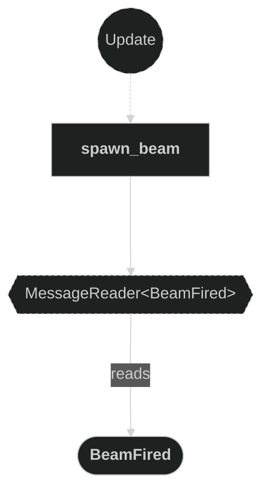
```mermaid
---
config:
  theme: dark
---

flowchart TD
classDef system-group stroke-dasharray: 5 5
classDef reader stroke-dasharray: 3 3

update(("`Update`")):::system-group
spawn_beam["`**spawn_beam**`"]

update -.-> spawn_beam

message_reader{{"MessageReader#60;BeamFired#62;"}}:::reader
spawn_beam ---> message_reader

beam_fired_message(["`**BeamFired**`"])

message_reader ---> |reads| beam_fired_message
```

### Query Beam entities (spawn)

Used in the following systems:
- **spawn_beam**: reads `Beam.owner`, `Beam.direction`, and `GridCoords` of all active beams to detect lane overlap before deciding whether to insert `BounceEffect`

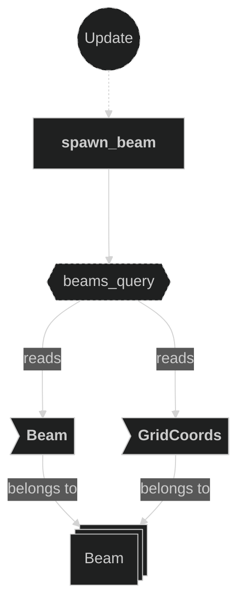
```mermaid
---
config:
  theme: dark
---

flowchart TD
classDef system-group stroke-dasharray: 5 5
classDef query stroke-dasharray: 3 3

update(("`Update`")):::system-group
spawn_beam["`**spawn_beam**`"]

update -.-> spawn_beam

beams_query{{"`beams_query`"}}:::query
spawn_beam ---> beams_query

beam_entity@{ shape: st-rect, label: "Beam" }

be_beam>"`**Beam**`"] --> |belongs to| beam_entity
be_grid_coords>"`**GridCoords**`"] --> |belongs to| beam_entity

beams_query ---> |reads| be_beam
beams_query ---> |reads| be_grid_coords
```

### Read behavior-selection inputs (spawn)

Used in the following systems:
- **spawn_beam**: to resolve the shot via `resolve_fire`, reads the firing player's `AbilityList` (for the `Lance` descriptor) and `MapInfo.claimed_entities` + the `ClaimedTile.owner` at the origin (to test whether the origin tile is already claimed). A claimed origin without `Lance` yields no beam; a claimed origin with `Lance` yields `Lance`; an unclaimed origin yields `Straight`.

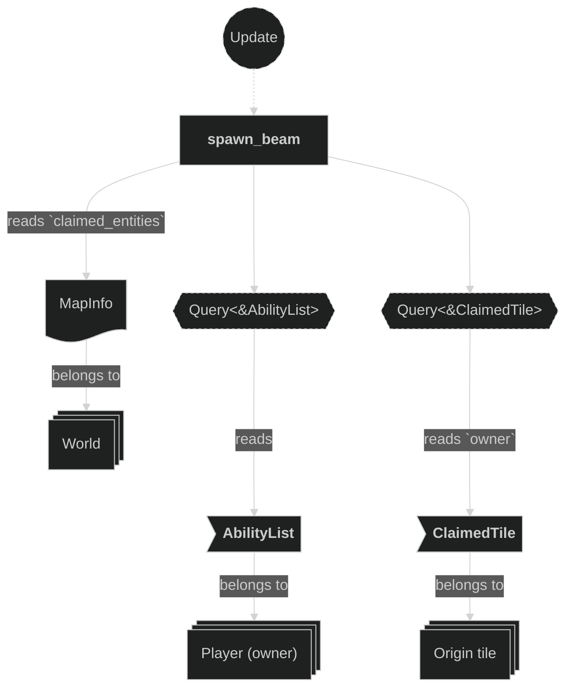
```mermaid
---
config:
  theme: dark
---

flowchart TD
classDef system-group stroke-dasharray: 5 5
classDef query stroke-dasharray: 3 3

update(("`Update`")):::system-group
spawn_beam["`**spawn_beam**`"]

update -.-> spawn_beam

ability_query{{"Query#60;#38;AbilityList#62;"}}:::query
claimed_query{{"Query#60;#38;ClaimedTile#62;"}}:::query
spawn_beam ---> ability_query
spawn_beam ---> claimed_query

player_entity@{ shape: st-rect, label: "Player (owner)" }
pe_ability>"`**AbilityList**`"] --> |belongs to| player_entity
ability_query ---> |reads| pe_ability

tile_entity@{ shape: st-rect, label: "Origin tile" }
te_claimed>"`**ClaimedTile**`"] --> |belongs to| tile_entity
claimed_query ---> |reads `owner`| te_claimed

world@{ shape: st-rect, label: "World" }
map_info_res@{ shape: doc, label: "MapInfo" }
map_info_res --> |belongs to| world
spawn_beam ---> |reads `claimed_entities`| map_info_res
```

### Read MapInfo resource (beam step)

Used in the following systems:
- **beam_step**: checks `on_ground()` and `on_forbidden_areas()` for the next position and resolves tile entities via `claimed_entities`

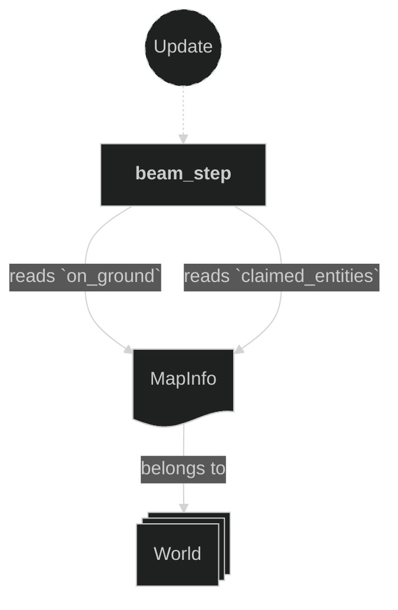
```mermaid
---
config:
  theme: dark
---

flowchart TD
classDef system-group stroke-dasharray: 5 5

update(("`Update`")):::system-group
beam_step["`**beam_step**`"]

update -.-> beam_step

world@{ shape: st-rect, label: "World" }
map_info_res@{ shape: doc, label: "MapInfo" }

map_info_res --> |belongs to| world

beam_step ---> |reads `on_ground`| map_info_res
beam_step ---> |reads `claimed_entities`| map_info_res
```

### Write commands — spawn Beam entity

Used in the following systems:
- **spawn_beam**: spawns a new `Beam` entity with grid position, beam data, and bounce effect

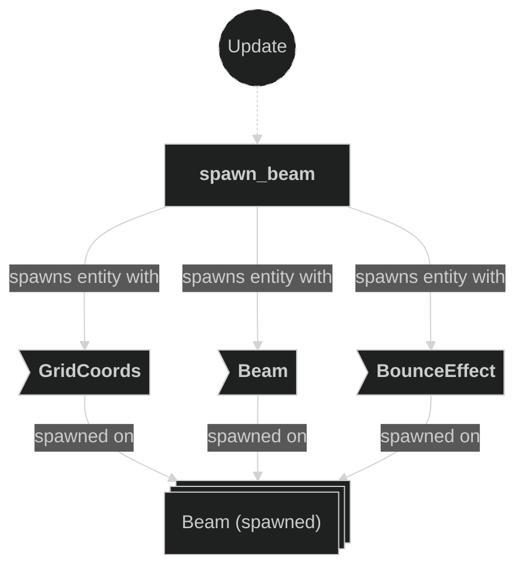
```mermaid
---
config:
  theme: dark
---

flowchart TD
classDef system-group stroke-dasharray: 5 5

update(("`Update`")):::system-group
spawn_beam["`**spawn_beam**`"]

update -.-> spawn_beam

beam_entity@{ shape: st-rect, label: "Beam (spawned)" }

be_grid_coords>"`**GridCoords**`"]
be_beam>"`**Beam**`"]
be_bounce>"`**BounceEffect**`"]

be_grid_coords --> |spawned on| beam_entity
be_beam --> |spawned on| beam_entity
be_bounce --> |spawned on| beam_entity

spawn_beam ---> |spawns entity with| be_grid_coords
spawn_beam ---> |spawns entity with| be_beam
spawn_beam ---> |spawns entity with| be_bounce
```

### Query Beam entities

Used in the following systems:
- **beam_step**: reads `Beam` (owner + direction) and writes `GridCoords` on all active beam entities each timer tick

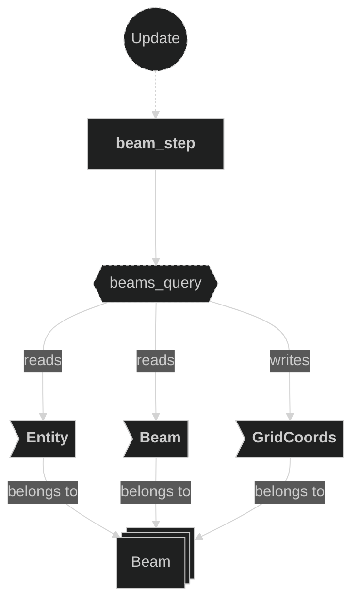
```mermaid
---
config:
  theme: dark
---

flowchart TD
classDef system-group stroke-dasharray: 5 5
classDef query stroke-dasharray: 3 3

update(("`Update`")):::system-group
beam_step["`**beam_step**`"]

update -.-> beam_step

beams_query{{"`beams_query`"}}:::query
beam_step ---> beams_query

beam_entity@{ shape: st-rect, label: "Beam" }

be_entity>"`**Entity**`"] --> |belongs to| beam_entity
be_beam>"`**Beam**`"] --> |belongs to| beam_entity
be_grid_coords>"`**GridCoords**`"] --> |belongs to| beam_entity

beams_query ---> |reads| be_entity
beams_query ---> |reads| be_beam
beams_query ---> |writes| be_grid_coords
```

### Query ClaimedTile (beam step)

Used in the following systems:
- **beam_step**: checks whether the next ground tile's `ClaimedTile` already has an owner to decide if the beam must stop (Straight mode) or is unclaimed and should trigger resolution (Lance mode)

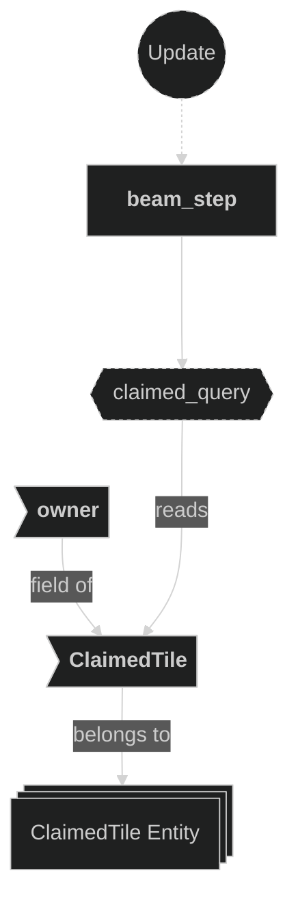
```mermaid
---
config:
  theme: dark
---

flowchart TD
classDef system-group stroke-dasharray: 5 5
classDef query stroke-dasharray: 3 3

update(("`Update`")):::system-group
beam_step["`**beam_step**`"]

update -.-> beam_step

claimed_query{{"`claimed_query`"}}:::query
beam_step ---> claimed_query

claimed_tile_entity@{ shape: st-rect, label: "ClaimedTile Entity" }

ct_claimed>"`**ClaimedTile**`"] --> |belongs to| claimed_tile_entity
ct_owner>"`**owner**`"] --> |field of| ct_claimed

claimed_query ---> |reads| ct_claimed
```

### Write BeamResolved messages

Used in the following systems:
- **beam_step**: emits a `BeamResolved` message with the beam's current position and owner when the beam stops (out of bounds or claimed tile hit)

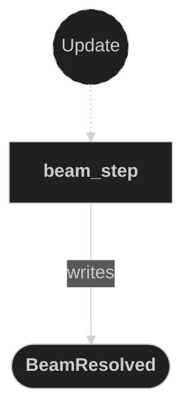
```mermaid
---
config:
  theme: dark
---

flowchart TD
classDef system-group stroke-dasharray: 5 5

update(("`Update`")):::system-group
beam_step["`**beam_step**`"]

update -.-> beam_step

beam_resolved_message(["`**BeamResolved**`"])

beam_step ---> |writes| beam_resolved_message
```

### Write commands — despawn Beam entity

Used in the following systems:
- **beam_step**: via the shared `end_beam` helper, despawns the beam entity when a stopping condition is met (after emitting `BeamResolved`, if any), synchronously decrementing the owner's `InFlightBeamCount` in the same call

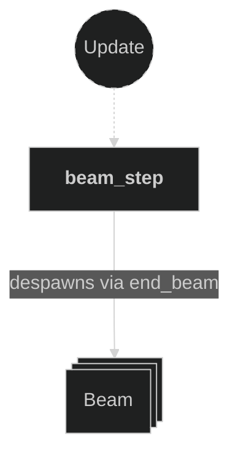
```mermaid
---
config:
  theme: dark
---

flowchart TD
classDef system-group stroke-dasharray: 5 5

update(("`Update`")):::system-group
beam_step["`**beam_step**`"]

update -.-> beam_step

beam_entity@{ shape: st-rect, label: "Beam" }

beam_step ---> |despawns via end_beam| beam_entity
```

### Query BeamCharges and InFlightBeamCount (spawn_beam)

Used in the following systems:
- **spawn_beam**: reads and mutably decrements `BeamCharges::current`, and increments `InFlightBeamCount::current`, on the firing player entity — once per committed shot (i.e. only when `resolve_fire` yields a behavior)

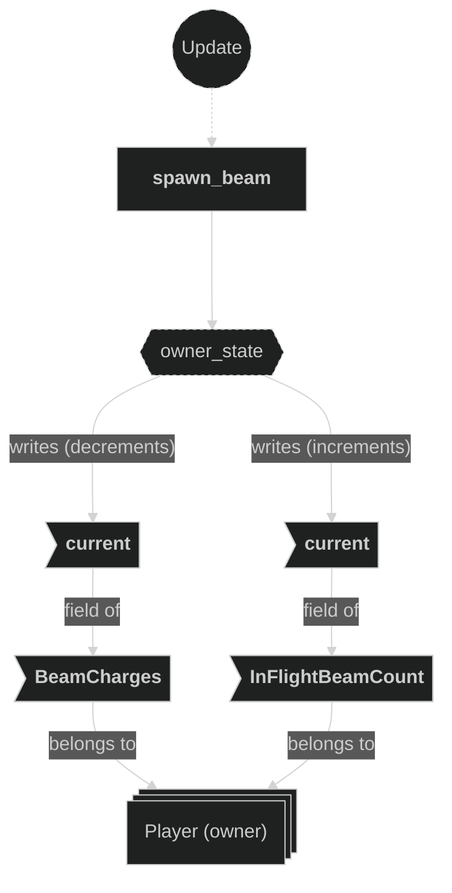
```mermaid
---
config:
  theme: dark
---

flowchart TD
classDef system-group stroke-dasharray: 5 5
classDef query stroke-dasharray: 3 3

update(("`Update`")):::system-group
spawn_beam["`**spawn_beam**`"]

update -.-> spawn_beam

owner_state_query{{"`owner_state`"}}:::query
spawn_beam ---> owner_state_query

player_entity@{ shape: st-rect, label: "Player (owner)" }

pe_charges>"`**BeamCharges**`"] --> |belongs to| player_entity
pe_current>"`**current**`"] --> |field of| pe_charges
pe_in_flight>"`**InFlightBeamCount**`"] --> |belongs to| player_entity
pe_in_flight_current>"`**current**`"] --> |field of| pe_in_flight

owner_state_query ---> |"writes (decrements)"| pe_current
owner_state_query ---> |"writes (increments)"| pe_in_flight_current
```

### Write ChargeSpent messages

Used in the following systems:
- **spawn_beam**: emits a `ChargeSpent` message (`owner`, `amount`) each time a charge is spent on fire, i.e. each time `resolve_fire` yields a behavior (no consumers yet)

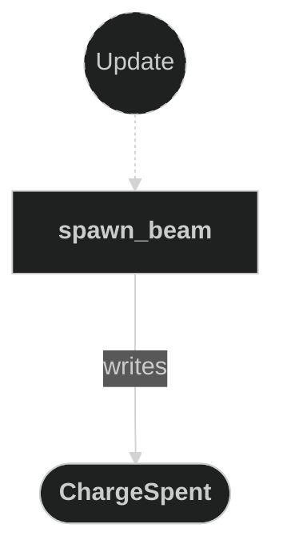
```mermaid
---
config:
  theme: dark
---

flowchart TD
classDef system-group stroke-dasharray: 5 5

update(("`Update`")):::system-group
spawn_beam["`**spawn_beam**`"]

update -.-> spawn_beam

charge_spent_message(["`**ChargeSpent**`"])

spawn_beam ---> |writes| charge_spent_message
```

### InFlightBeamCount component lifecycle

`InFlightBeamCount { current: u32 }` (`src/components/beam.rs`) is a per-player counter, synchronously maintained so readers never see the `Commands` spawn/despawn latency of `Beam` entities. Its full lifecycle:
- **Inserted** by `initialize_players` (Maps plugin), defaulted to `0`, alongside `BeamCharges` and `ClaimedTileCount`.
- **Incremented** by `spawn_beam` (this plugin), in the same loop iteration as the charge spend, only when `resolve_fire` yields a behavior.
- **Decremented** by `beam_step` (this plugin), via the shared `end_beam` helper, at each of its despawn call-sites — unconditionally, whether or not that stop also emits `BeamResolved`.
- **Reset to `0`** by `reset_round` (Round plugin), alongside the other per-player counters, on every round reset.
- **Read** by `animate_charges_bar` (HUD plugin), added into that player's charges-bar ratio so a fired-but-unresolved beam still counts toward it without the frame-lag a live `Query<&Beam>` scan would introduce.
- **Read** by `resolve_charge_exhaustion` (Round plugin), in place of a `Query<With<Beam>>` scan, to wait for the board to fully settle (no player's beams still in flight) before ending a round on mutual charge exhaustion.

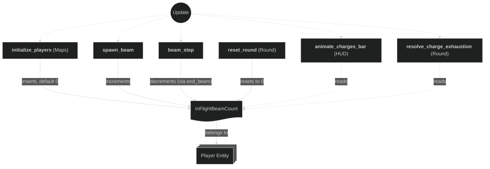
```mermaid
---
config:
  theme: dark
---

flowchart TD
classDef system-group stroke-dasharray: 5 5

update(("`Update`")):::system-group
initialize_players["`**initialize_players** (Maps)`"]
spawn_beam["`**spawn_beam**`"]
beam_step["`**beam_step**`"]
animate_charges_bar["`**animate_charges_bar** (HUD)`"]
resolve_charge_exhaustion["`**resolve_charge_exhaustion** (Round)`"]
reset_round["`**reset_round** (Round)`"]

update -.-> initialize_players
update -.-> spawn_beam
update -.-> beam_step
update -.-> animate_charges_bar
update -.-> resolve_charge_exhaustion

player_entity@{ shape: st-rect, label: "Player Entity" }
in_flight_component@{ shape: doc, label: "InFlightBeamCount" }

initialize_players ---> |inserts, default 0| in_flight_component
spawn_beam ---> |increments| in_flight_component
beam_step ---> |"decrements (via end_beam)"| in_flight_component
reset_round ---> |resets to 0| in_flight_component
in_flight_component --> |belongs to| player_entity
animate_charges_bar -..-> |reads| in_flight_component
resolve_charge_exhaustion -..-> |reads| in_flight_component
```
