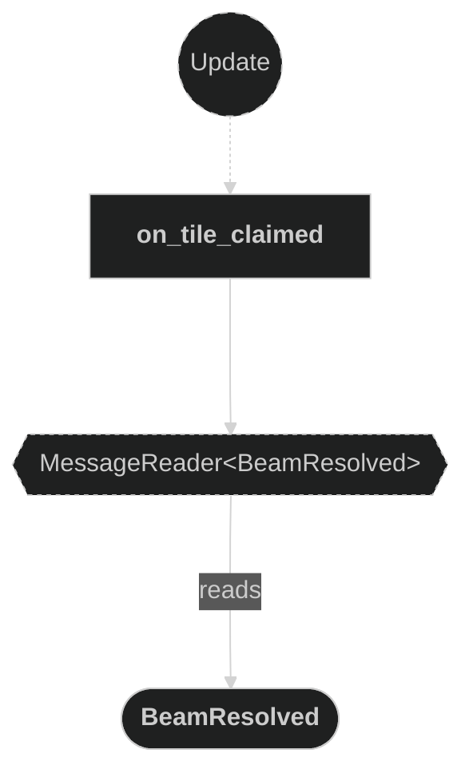
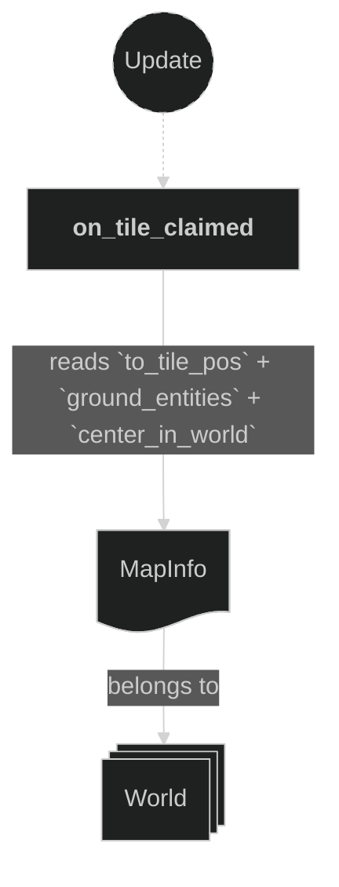
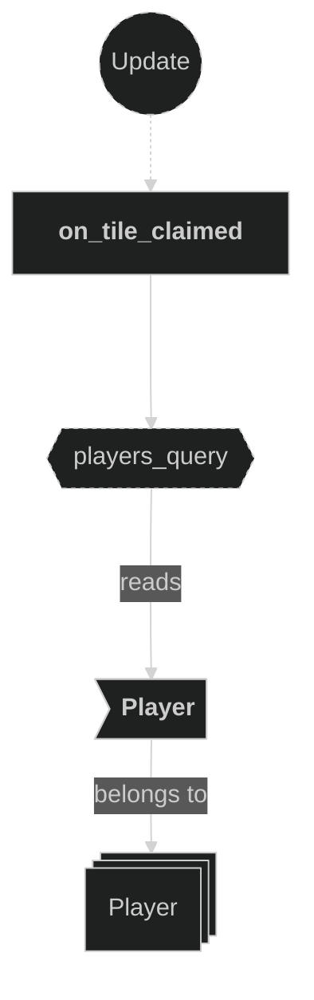
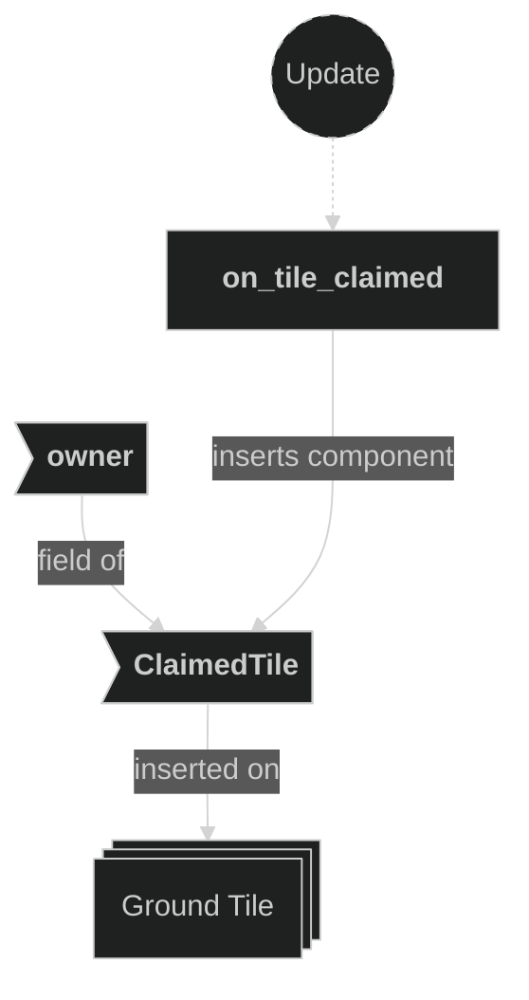
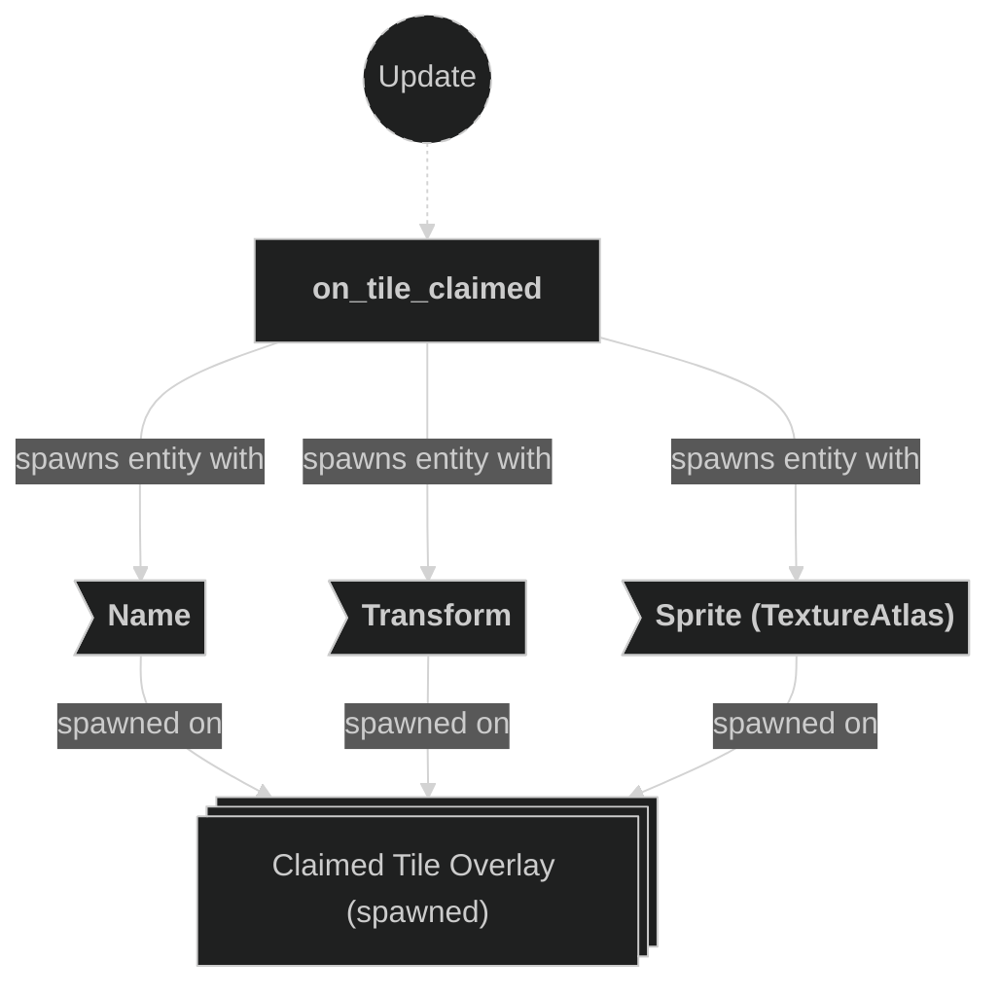

# Claim Plugin

Contains the system responsible for processing tile claim events. When a `BeamResolved` message is received, this plugin marks the corresponding ground tile entity with a `ClaimedTile` component and spawns a colored sprite overlay on that tile to visually indicate which player owns it.

## Plugin workflow

- Update phase
    - On Tile Claimed:
        - Reacts to `BeamResolved` message
            - Reads:
                - `MapInfo` resource (to resolve `GridCoords` → `TilePos` → tile `Entity` and compute world-space tile transform)
                - `Player` component on the owning player entity (to determine the sprite atlas index)
            - Writes:
                - Inserts `ClaimedTile` component on the ground tile entity
                - Spawns a colored sprite overlay entity at the tile's world position

## Plugin Systems

### On Tile Claimed

Reacts to `BeamResolved` messages. For each message it:
1. Resolves the `GridCoords` position to a `TilePos` and looks up the corresponding ground tile entity via `MapInfo::ground_entities`.
2. Looks up the owning `Player` to determine the correct sprite atlas index (index 6 for player 0, index 7 for player 1).
3. Inserts a `ClaimedTile { owner }` component on the ground tile entity.
4. Spawns a new overlay sprite entity at the tile's world-space center (z = −0.1) using the `grid_tiles2-Sheet.png` atlas.

## Components, Resources and Messages CRUD

### Read BeamResolved messages

Used in the following systems:
- **on_tile_claimed**: used to trigger tile ownership processing

### Read MapInfo resource

Used in the following systems:
- **on_tile_claimed**: used to resolve `GridCoords` → `TilePos`, look up the ground tile entity via `ground_entities`, and compute the tile world-space transform via `center_in_world()`

### Query Player

Used in the following systems:
- **on_tile_claimed**: reads the `Player` component on the owning entity to determine the correct sprite atlas index

### Write ClaimedTile component

Used in the following systems:
- **on_tile_claimed**: inserts `ClaimedTile { owner }` on the ground tile entity to mark it as owned

### Write commands (spawn overlay sprite)

Used in the following systems:
- **on_tile_claimed**: spawns a colored sprite overlay entity at the claimed tile's world-space center

