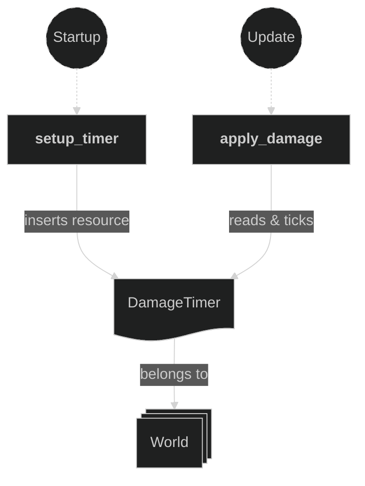
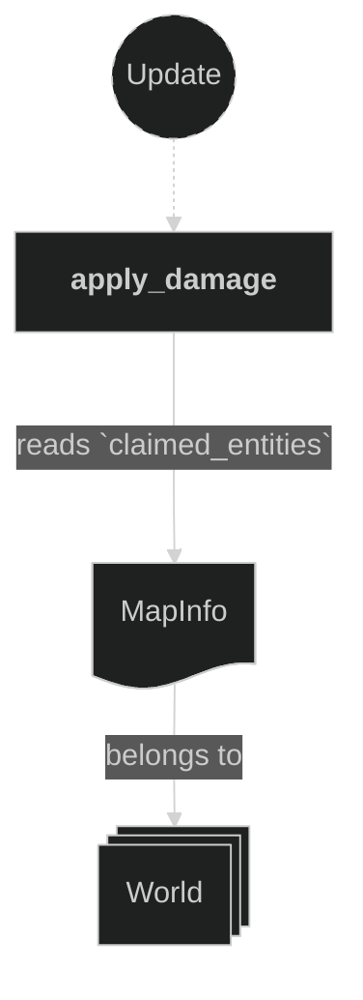
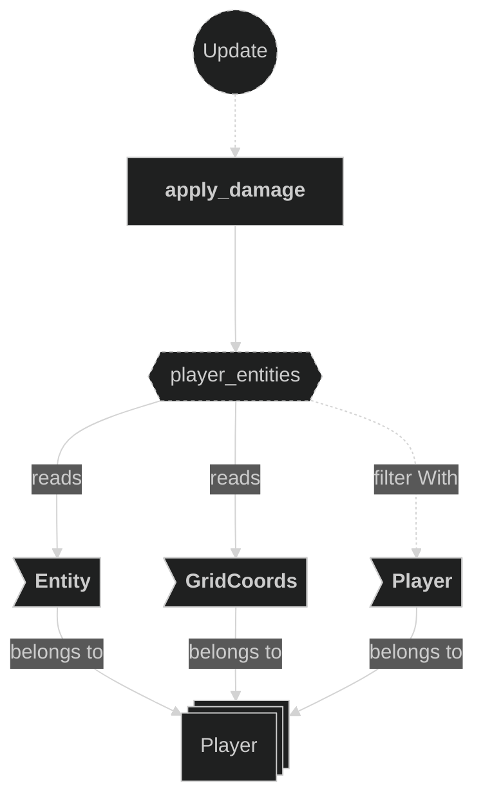
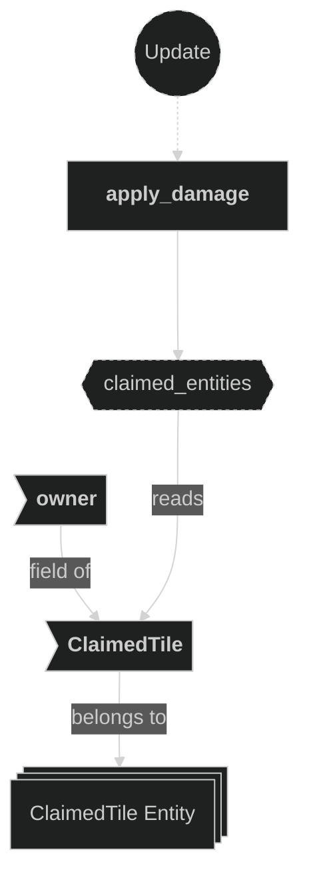
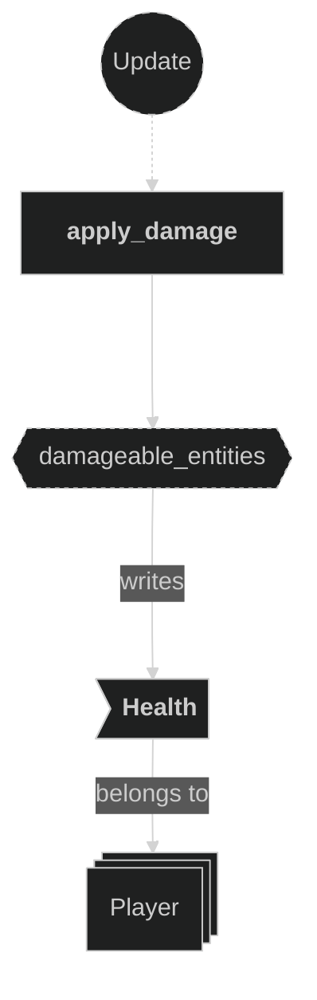
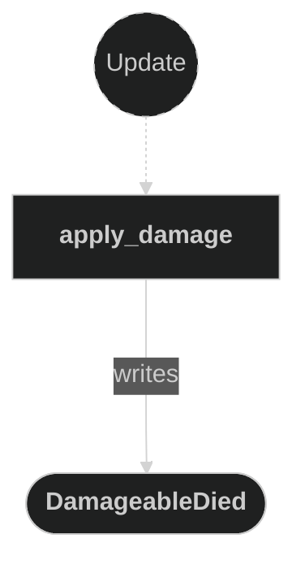

# Damage Plugin

Contains systems responsible for applying damage to players standing on opponent-owned tiles, and for emitting `DamageableDied` messages when a player's health reaches zero. Damage is applied on a fixed timer cadence rather than every frame, giving players a brief window to move off a dangerous tile.

## Plugin workflow

- Startup phase
    - `setup_timer` inserts the `DamageTimer` resource — a repeating `Timer` with a 500 ms period.
- Update phase
    - `apply_damage`:
        - Ticks the `DamageTimer` each frame
        - When the timer fires, iterates all `Player` entities and checks whether their current `GridCoords` sits on a tile owned by an opposing player
            - Reads:
                - `DamageTimer` resource
                - `Player` entity `GridCoords` and `Entity`
                - `ClaimedTile` components on claimed tile entities (via `MapInfo::claimed_entities`)
                - `MapInfo` resource (to resolve `GridCoords` → claimed tile entity)
            - Writes:
                - Applies 1.0 damage to the player's `Health` component each tick while on an opponent tile
                - Emits a `DamageableDied` message when the player's `Health` reaches zero

## Plugin Systems

### Setup Timer

Runs once at startup. Inserts the `DamageTimer` resource — a repeating `Timer` configured to fire every 500 ms — which gates how often the `apply_damage` system deals damage to players.

### Apply Damage

Runs every frame. Ticks the `DamageTimer` and, when the timer finishes:

1. Iterates all `Player` entities, reading their `Entity` and `GridCoords`.
2. Resolves the `GridCoords` to a claimed tile entity via `MapInfo::claimed_entities`.
3. Reads the `ClaimedTile` component on that entity to determine the current owner.
4. If the owner is a different player than the one standing on the tile, decrements that player's `Health` by 1.0.
5. If the player's `Health` has reached zero, emits a `DamageableDied` message carrying the player's `Entity`.

## Components, Resources and Messages CRUD

### Read DamageTimer resource

Used in the following systems:
- **apply_damage**: ticks and checks the damage cadence timer each frame

### Read MapInfo resource

Used in the following systems:
- **apply_damage**: used to resolve player `GridCoords` to a claimed tile entity via `MapInfo::claimed_entities`

### Query Player entities

Used in the following systems:
- **apply_damage**: reads the `Entity` and `GridCoords` of every `Player`-marked entity to determine their position each damage tick

### Query ClaimedTile entities

Used in the following systems:
- **apply_damage**: reads `ClaimedTile::owner` on claimed tile entities to determine if a player is standing on an opponent-owned tile

### Write Health component

Used in the following systems:
- **apply_damage**: decrements the `Health` component of the player standing on an opponent tile by 1.0 on each damage tick

### Write DamageableDied messages

Used in the following systems:
- **apply_damage**: emits a `DamageableDied` message carrying the player `Entity` when their `Health` reaches zero

